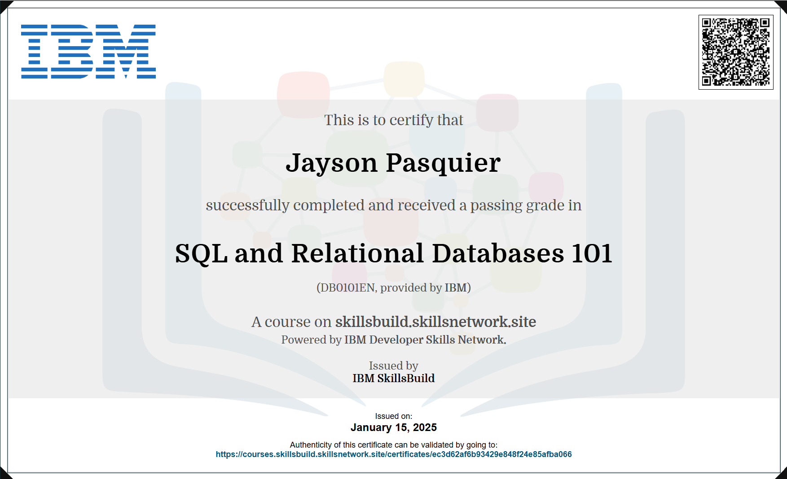
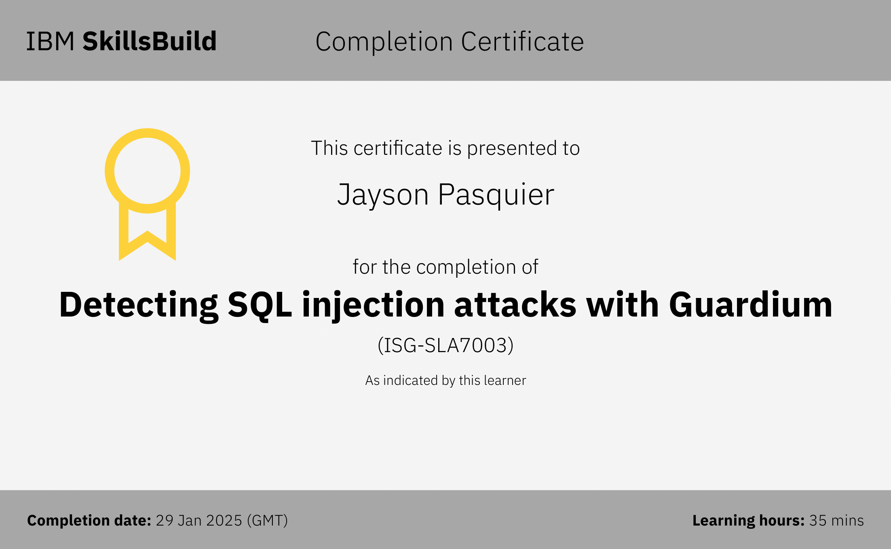

# SQL and Relational Databases - README

## Course Overview

This document provides an overview of the course "SQL and Relational Databases," including its prerequisites, content, and certification details. A visual representation of the PDF outlining the course structure is included below for clarity.

## When Can You Start?

- You can begin this course alongside the SQL/MySQL projects.
- Alternatively, you can take this course after completing the SQL/MySQL projects.

## Prerequisites and Requirements

- **SQL Knowledge**: While prior knowledge of SQL is not mandatory, it is recommended to facilitate easier learning.
- **Course Sequence**: You may start this course before working on the SQL/MySQL projects available on the intranet.

## Certificate and Learning Objectives

### Certification Details

To earn the certificate, you must complete the course "SQL and Relational Databases."

### Key Concepts Covered

- **Basics of SQL and Relational Databases**
  - Fundamental principles of SQL
  - Understanding relational database structures

- **Data Definition Language (DDL)**
  - Creating, altering, and managing database schemas

- **Data Manipulation Language (DML)**
  - Inserting, updating, and deleting data within tables

- **Joins**
  - Combining data from multiple tables
  - Various types of joins (INNER, LEFT, RIGHT, FULL)

- **Other Topics**
  - Additional concepts and practical applications of SQL

# Detecting SQL Injections attacks with Guardium

## Course Overview

This document provides an overview of the course " Detecting SQL Injection Attacks with Guardium" including its prerequisites, content, and certification details. A visual representation of the PDF outlining the course structure is included below for clarity.

## Prerequisites and Requirements

- **SQL Knowledge**: Knowledge of SQL and MySQL is mandatory.
- **SQL Injection Understanding**: Understanding what an SQL injection attack is.
- **Resources for Learning**: If unfamiliar with SQL injection, learn through:
  - SQL Injection
  - SQL Injections (SQLi): Principles, Impacts, Exploitation, and Security Best Practices

## Certificate and Learning Objectives

### Certification Details

To earn the certificate, you must complete the course "Detecting SQL Injection Attacks with Guardium."

### Key Concepts Covered

- **SQL Injection Fundamentals**
  - What an SQL injection attack is
- **Detection Methods**
  - How to detect an SQL injection attack using Guardium Data Protection
- **Protection Strategies**
  - How to protect against such attacks
