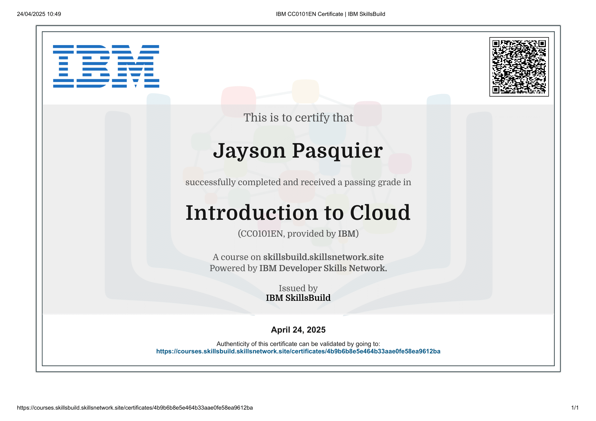

# Introduction to Cloud Computing - README

## 0. Trimester 3 - Certificate: Introduction to Cloud Computing

### When Can You Start?
You can take this course at the beginning of the 3rd trimester or after obtaining the certificates from the 1st and 2nd trimesters.

### Prerequisites and Requirements
This course is accessible with no prerequisites.

### Certificate and Learning
The course to complete for the certificate is Introduction to Cloud.

Some of the concepts you will learn in this course include:
- Basics of cloud computing
- Terminologies
- History
- Different types of storage
- Deployment models
- Virtualization
- etc.

### Repo:
- GitHub repository: holbertonschool-france-certificates-ibm
- Directory: certificates-trimester-3
- File: certificate-cloud
